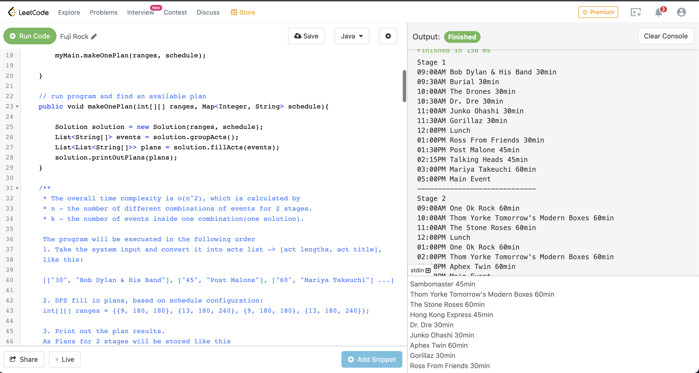

# Assignment

## Updates

---
1. [Object Oriented Design](#object-oriented-design)
2. [Installation & Deployment](#installation--deployment)

## Object Oriented Design

---
```java
models
    Acts
    Event
    Schedule
    Stages
```
In model package, there are 4 main models. \
`Acts` is used to store details of each act. \
`Event` is the object which stores the info of the entire Fuji Rock Festival. \
`Schedule` is used for storing the event start and end time as a configuration \
`Stages` contains a list of Acts which will be hold in current stage.

```java
services
    Outputs
    Utils
```
`Outputs` and `Utils` are the interfaces of formatting outputs for the event and 
common & inputs reading methods \
The reason of why I make those as interfaces are in order to extend the current program to meet 
different usages requirements. In current assignment, we read inputs from file and use `system.out` to 
print plans. If we get a requirement to ask us using `system.in` as inputs.\
Then we just need to have another implementation in `serviceImpl` package.


## Installation & Deployment

---
`IMPORTANT`:
In case of the online editor doesn't save the correct version of my solution.
I create a `Backup.java` file in the project. If you get any error from the online editor,
please copy and paste the code from the backup file and use the test cases in `testcases` folder.
Thank you!

1. There is no need for installation & Deployment in your local machine, in order to run the code.
Here is the [online editor](https://leetcode.com/playground/SBHsM3xm) where you can run the program.


2. You can also download the project from git and run in local.\
Run Configuration: `main.java` 
Environment: `Java 17` and `OpenJDK 17.0.1`

## Design pattern

----

In order to match the online editor's format. The Solution class is put inside Main.java.
Ideally it should be in another separated file.

#### Configurations
In order to make the code extendable. I make 2 configuration parameters for it.
1. ranges: an array which stores the time and length info to schedule a stage.
   To make a ranges like this, we can simply change the value in it and make changes to the event start/end time
   `{9, 180, 240}` this means the group of event will be started at `9am` and lasts `180 to 240 mins`
2. schedule: a map which stores the info of default events information
```json
        {
          9 : "12:00PM Lunch",
          13 : "05:00PM Main models.Event"
        }
```
To extend or modify the schedule, we can simply add more items inside `ranges` and `schedule`
to let the program find the plan for more stages and different time period
```java
        //The schedule we would like to fill in.
        // {13, 180, 240} - the config info of a schedule time period
        // while means 13 - 1:00PM; 
        // 180, 240 - the protential time period, the event may finish in 3hr to 4hr
        int[][] ranges = {{9, 180, 180}, {13, 180, 240}, {9, 180, 180}, {13, 180, 240}}; 

        // schedule map will look like this
        // 9 : "12:00PM Lunch"
        // 13 : "05:00PM Main models.Event"
        Map<Integer, String> schedule = new HashMap<>();
        schedule.put(9, "12:00PM Lunch"); 
        schedule.put(13, "05:00PM Main models.Event");
```
Also there is another maintenance benefit to make those as configurations. Those data can be created by another program and passed to
this code. We don't need to make any changes to this part of code if the schedule data format gets
changes somewhere.

#### Program Process
The program will be executed in the following order
1. Take the system input and convert it into acts list -> `[act lengths, act title]`, like this:
```text
     [["30", "Bob Dylan & His Band"], ["45", "Post Malone"], ["60", "Mariya Takeuchi"] ...]
```

2. DFS fill in plans, based on schedule configuration.
   The program will use DFS to try different combinations of acts to match schedule requirements from configurations.
   And use a `boolean[]` to avoid duplications.

3. Print out the plan results.
   If we are able to find a valid plan from the input, the program will print out the information
   As in assignment requirements. The plan is only for 2 stages. So it will be stored like this
```text
[List[Morning], List[Afternoon], List[Morning], List[Afternoon]]
```
### Sample program output
```text
Stage 1
09:00AM Bob Dylan & His Band 30min
09:30AM Burial 30min
10:00AM The Drones 30min
10:30AM Dr. Dre 30min
11:00AM Junko Ohashi 30min
11:30AM Gorillaz 30min
12:00PM Lunch
01:00PM Ross From Friends 30min
01:30PM Post Malone 45min
02:15PM Radwimps 45min
03:00PM Mariya Takeuchi 60min
05:00PM Main models.Event
-----------------------------
Stage 2
09:00AM Scandal 45min
09:45AM Talking Heads 45min
10:30AM Sambomaster 45min
11:15AM Hong Kong Express 45min
12:00PM Lunch
01:00PM One Ok Rock 60min
02:00PM Thom Yorke Tomorrow's Modern Boxes 60min
03:00PM The Stone Roses 60min
05:00PM Main models.Event
-----------------------------
```

### Test cases
This the act data from assignment.
```text
Mariya Takeuchi 60min
Post Malone 45min
Bob Dylan & His Band 30min
Radwimps 45min
Scandal 45min
Special announcement
One Ok Rock 60min
Talking Heads 45min
Burial 30min
The Drones 30min
Sambomaster 45min
Thom Yorke Tomorrow's Modern Boxes 60min
The Stone Roses 60min
Hong Kong Express 45min
Dr. Dre 30min
Junko Ohashi 30min
Aphex Twin 60min
Gorillaz 30min
Ross From Friends 30min
```

### Error Handling
The program doesn't do much on error handling. It assumes the input passed to it must be valid at this point.
However, I do add empty line check to let it skip empty lines from inputs. Like this
```text
Dr. Dre 30min


Junko Ohashi 30min

Aphex Twin 60min
Gorillaz 30min
```

### Time complexity
```text
* The overall time complexity is o(n^2), which is calculated by 
* n - the number of different combinations of events for 2 stages.
* k - the number of events inside one combination(one solution).
```

### Potential improvements
1. The current the program will be able to find one valid plan. However, we can make some changes on
```java
if (start >= this.stageNum || time > ranges[start][1] || this.plans.size() >= this.stageNum) return;
```
and add caching to have multiple different plans.

2. For the input like `Special announcement`, currently I assume we can only have one during the event. Since it doesn't make sense if we have
   2 stages which are only filled in `Special announcement` and no actual shows.
   However, we can make this as another configuration variable, to set a limit for it during the event. Like
```text
Special announcement : 5
```
3. Error handling improvements
   There are always room for improving error handling. like handling invalid inputs, configurations issue
